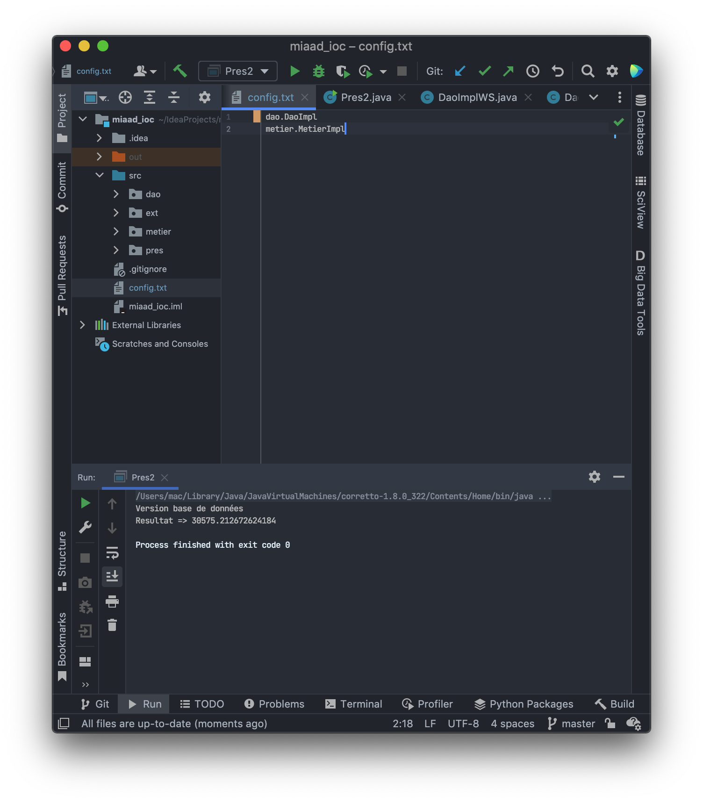
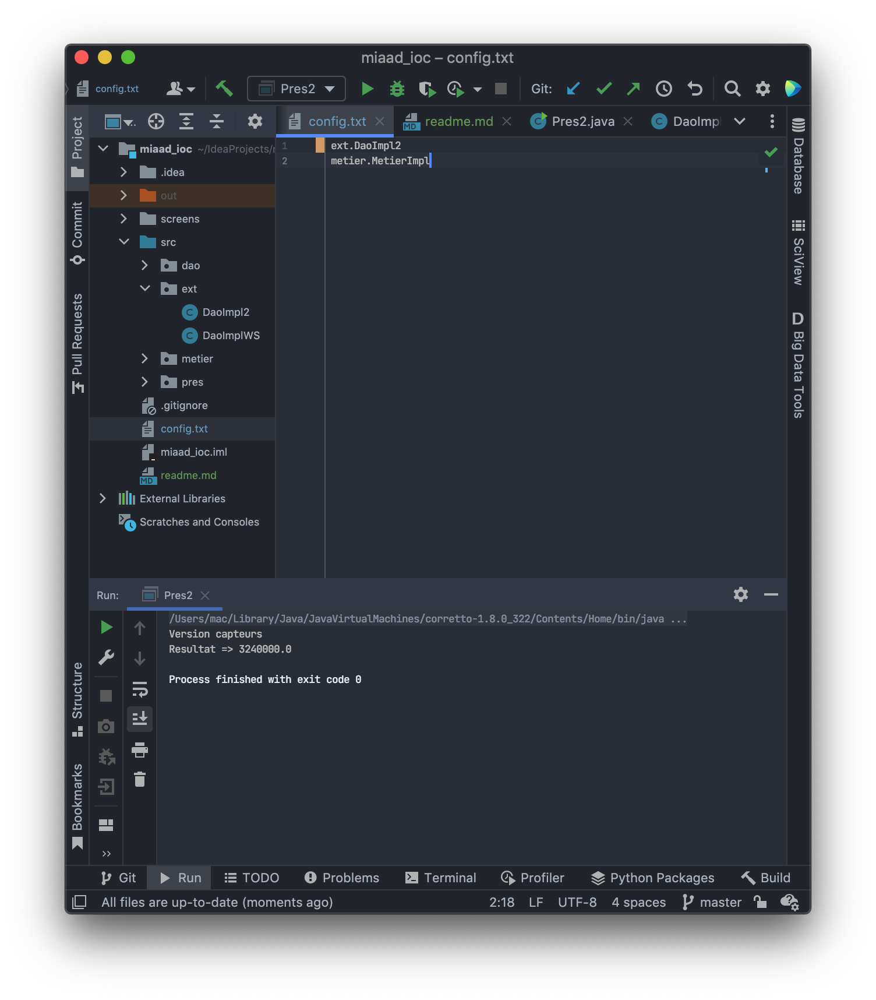

# Rapport de IOC [sans Spring Boot]

## Partie 1

Dans cet partie, l'instanciation de class presentation est faite d'une manier classis. Utilisons l'approche `ClassName obj = new ClassName();`
Et cet approche n'est pas pratique dand IOC.

## Partie 2

C'est pour cela on utilise la déclaration dynamique à l'aide d'un fichier `config` qui contient les noms de chaque classe qu'on a besoin.
Et par la suite on peux voir comment on peux basculer entre les trois versions d'obtenir les données à partier de DAO.

### Version base de données

### Version capteurs

### Version Web Service

